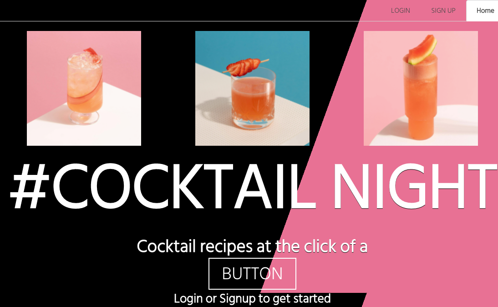
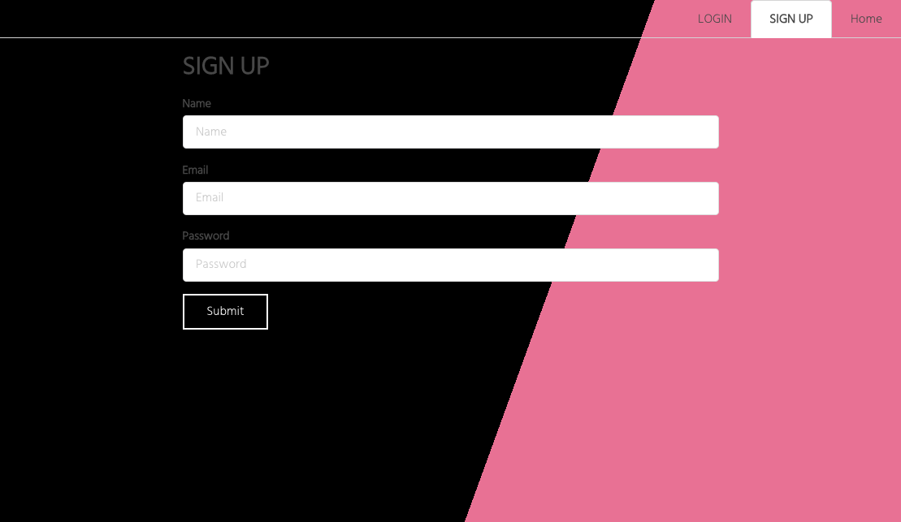
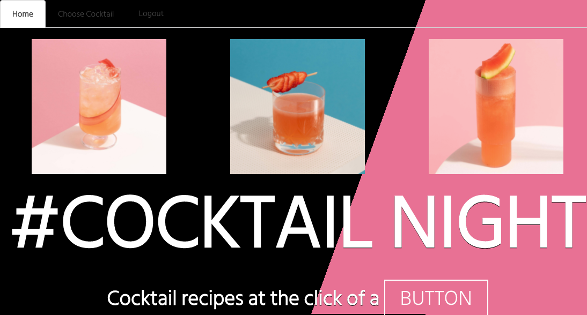
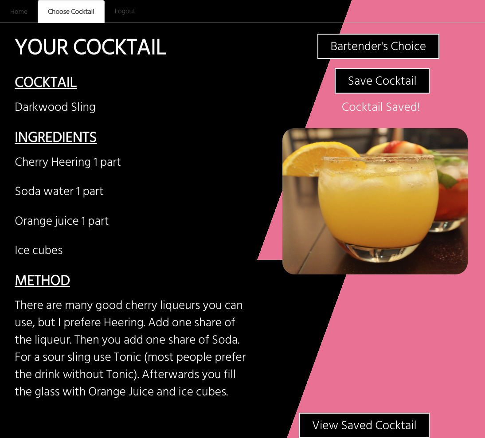
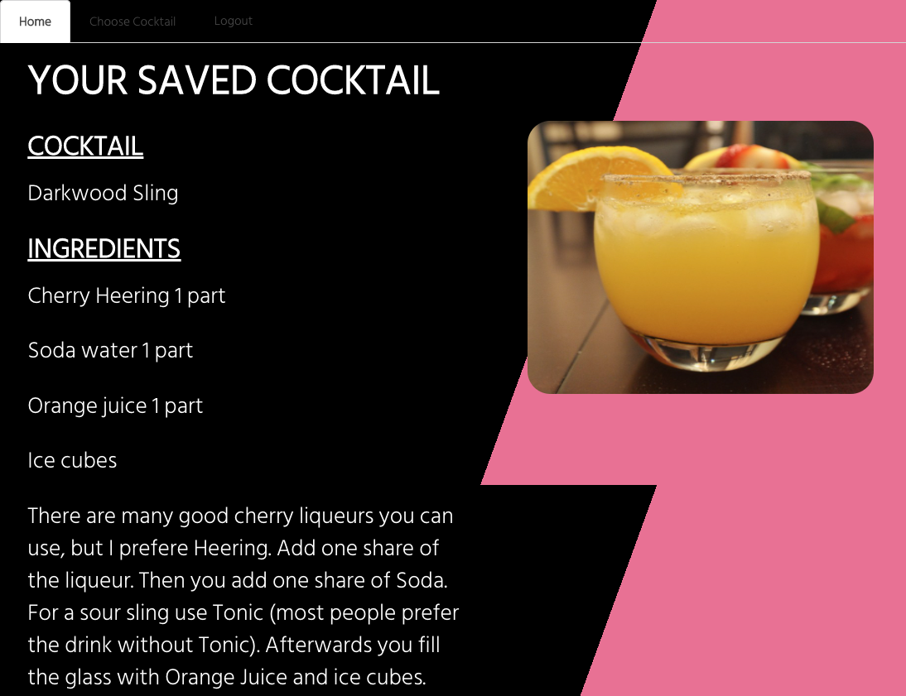

# Cocktail Night


## Description

Cocktail Night generates random cocktail recipes at the click of a button. It was created to save time whilst searching for cocktail recipes and help those with little cocktail knowledge or are just simply bad at decisions.

The application is perfect for those wanting to participate in the highly popular Instagram and Tik Tok trend [#cocktailnight](https://www.tiktok.com/tag/cocktailnight?lang=en).

Users must have an account to use Cocktail Night. They can then generate a random cocktail recipe and save that cocktail to their account. Once a cocktail has been saved it can them be viewed and referred back to.

The bartenders choice button will generate a new random cocktail (or mocktail as Cocktail Night promotes responsible drinking of alcohol).

The application is deployed on Heroku and be be viewed [here](https://ancient-badlands-55523.herokuapp.com/)

## Table of Contents

- [Installation](#installation)
- [Technologies](#technologies)
- [Live application](#liveapplication)
- [Future Development](#futuredevelopment)
- [License](#license)
- [Resources](#resources)
- [Questions](#questions)

## Installation

Clone the repo and run

```
npm install
```

## Technologies

The following tools and technologies were used to create this application

- MERN
  - [MongoDB](https://www.mongodb.com/)
  - [Express](https://expressjs.com/)
  - [React](https://reactjs.org/)
  - [Node](https://nodejs.org/en/)
- [GraphQL](https://graphql.org/)
- [Apollo](https://www.apollographql.com/docs/react/)
- [Bcrypt](https://www.npmjs.com/package/bcrypt)
- [JWT](https://jwt.io/)
- [The CocktailDB API](https://www.thecocktaildb.com/api.php)
- [Heroku](https://www.heroku.com/free)
- [Semantic UI](https://semantic-ui.com/introduction/getting-started.html)

## Live Application

[Link to deployed application](https://ancient-badlands-55523.herokuapp.com/)











## Future Development

In the second release of Cocktail Night users will be able to search cocktails via alcohol which will be suitable for users with greater cocktail knowledge.

As drinking cocktails is a social activity, slice two will incorporate this as users will be able to choose cocktails for their friends.

Lastly, in an effort to increase user experience for those not versed in the imperial system, units of measures will be converted to mls

## License

[MIT](https://choosealicense.com/licenses/mit/)

Copyright (c) 2021 Elise Harman

## Resources

- [Fetch Data from an API with React](https://www.better.dev/fetch-data-from-an-api-with-react)

- [Fetching Data from an API with React Hooks useEffect](https://www.youtube.com/watch?v=k0WnY0Hqe5c)

- [React Hooks](https://www.youtube.com/watch?v=k0WnY0Hqe5c)

- [React / GraphQL Course](https://www.youtube.com/watch?v=k0WnY0Hqe5c)

- [Tiny PNG](https://tinypng.com/)

- [CocktailDB API](https://www.thecocktaildb.com/api.php)

- [CSS Buttons](https://cssbuttons.app/buttons/43)

- [Icons](https://icon-icons.com/download/68766/PNG/32/)

## Questions

If you have any questions or would like to report and issue please contact me at my [GitHub](https://github.com/harmane4) or elise_harman@hotmail.com
